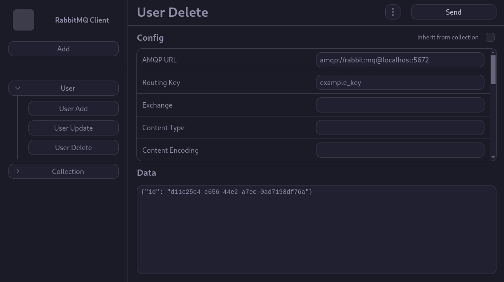

<div align="center">
<h1>RabbitMQ Web Client</h1>
<h5>HTMX + FastAPI app for sending messages to RabbitMQ</h5>



</div>

## Installation

### Docker

```bash
docker run -p 8000:8000 -v rabbitmq-web-client:/app/data marcinkonwiak/rabbitmq-web-client
```

## Development

### Running the project locally

After creating a virtual environment:
```bash
pip install -r requirements-dev.txt
alembic upgrade head
uvicorn src.main:app --reload
```

### Testing

```bash
pytest
```
